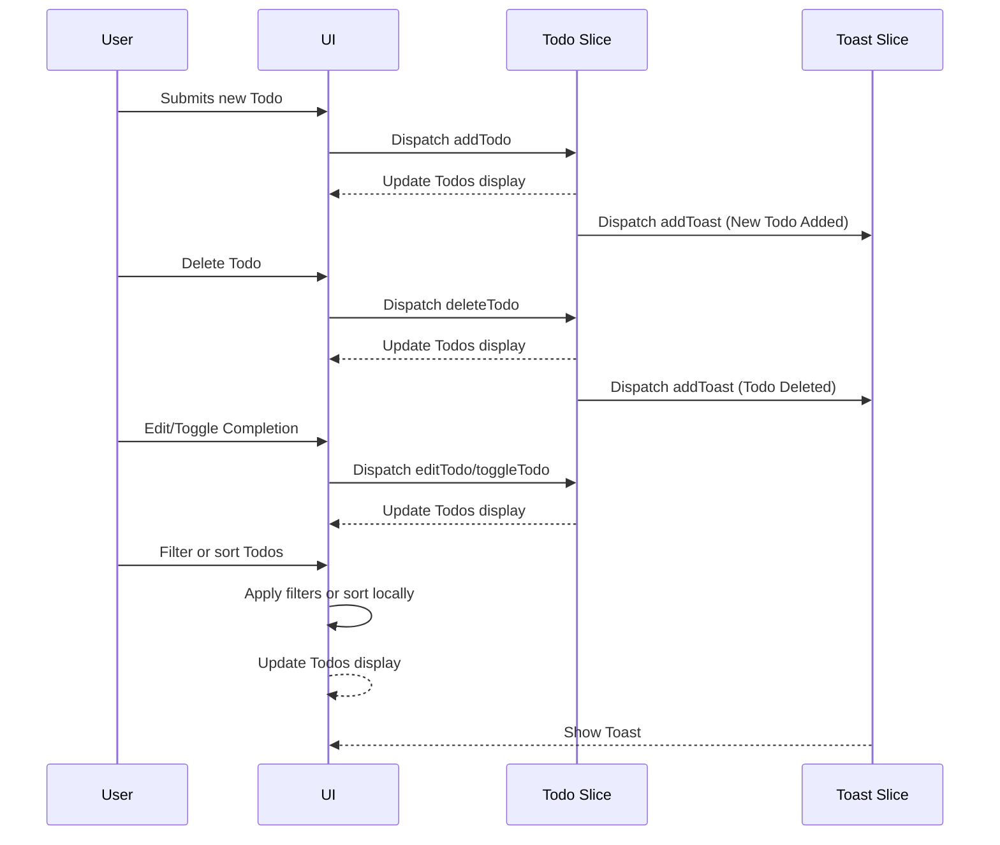

# To-Do-List

## 專案概覽

[Online demo](https://to-do-list.toddliao.dev)

## 環境配置

在開始之前，請先確保你的開發環境中已安裝：

- Node.js (v20 或更高)
- Yarn (v1)

### 安裝步驟

```bash
git clone git@github.com:toddLiao469469/to-do-list.git
cd to-do-list
yarn install
```

## 運行專案

### 本地開發

啟動本地開發的 dev server：

```bash
yarn dev
```

### 執行測試

運行專案的測試：

```bash
yarn test
```

### 打包程式

打包 prod 環境所需的程式碼：

```bash
yarn build
```

## 專案架構

### 檔案目錄

專案的檔案結構如下所示：

```plaintext
.
├── .github
│   └── workflows
└── src
    ├── api/
    ├── componsnts/
    │   └── common
    ├── assets/
    ├── pages/
    │   └── [PageName]/
    │       └── index.tsx
    ├── store/
    ├── utils/
    └── tests/
```

- **.github**: 存放 github actions 相關的設定
- **api**: 存放串接 API 相關的程式碼
- **components**: 管理 component
  - common: 存放本身沒有管理 state 等等相關操作的 atomic component
  - 其餘檔案/資料夾: 存放有 state 或者是由 atomic component 所組成的 component
- **assets**: 存放靜態資源
- **pages**: 存放每個頁面的特定 component 和 util
- **store**: 存放 Redux store
- **utils**: 存放共用 function 、 type 和 constants
- **tests**: 存放測試的程式碼

### Tech Stack

1. react
2. typescript
3. redux 與 redux toolkit: 管理全域狀態
4. vite: 打包以及 dev server
5. vitest: 測試框架
6. tailwindcss:  CSS 框架
7. daisyui:以 tailwindcss 為基礎的 component library

### CI/CD

本專案的 CI/CD 是透過 GitHub Actions 和 Cloudflare Pages 實做：

 • GitHub Actions: 每當有 PR 被開啟，GitHub Actions 將自動執行測試
 • Cloudflare Pages: 與 GitHub repo 整合，PR 開啟或更新時，Cloudflare Pages 會自動部署一個 preview 站點，以及 main branch 有新 commit 時將會自動部署到 [prod 站點](https://to-do-list.toddliao.dev)

### Sequence Diagram


